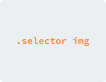
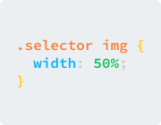
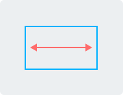

# CSS Glitcher 2.0 Documentation

* [Installation](installation/README.md)

---

CSS Glitcher &mdash; is a modern and expressive CSS glitch effect for web pages.

For example, you can use it with sites on the topic below:

* Sport
* Secure
* Internet
* Computer
* Fashion and more like that

## What's new?

**No more jQuery at all!**

**Custom selectors**

**Custom styles**

**Adaptive mode**

