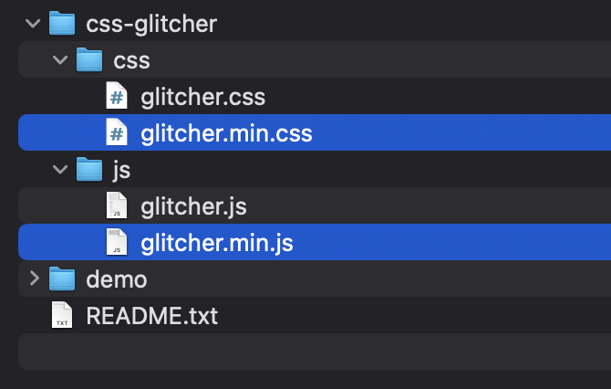

# Installation

* [1. Copy files into your website](#1-copy-files-into-your-website)
* [2. Include the files into your web pages](#2-include-the-files-to-your-web-pages)
* [3. Initialisation](#3-initialisation)
  + [Add `glitcher` CSS-class](#add-glitcher-css-class)
  + [Use your own selector](#use-your-own-selector)
* [4. Script parameters (optional)](#4-script-parameters-optional)
  + [`adaptiveSizes`](#adaptivesizes)
  + [`delay`](#delay)
    - [`autoMax`](#automax)
    - [`max`](#max)
    - [`min`](#min)

## 1. Copy files into your website
Copy minify version of files from `css-glitcher` folder into your website. Be sure you know URL to get access for these files.



## 2. Include the files to your web pages
Copy and paste code below before `</head>` tag on your web page using URL to files from previous step:

```html
<script src="css-glitcher/glitcher.min.js"></script>
<link rel="stylesheet" href="css-glitcher/glitcher.min.css">
```

> Be sure you have correct URL based on your file structure

## 3. Initialisation

You have 2 ways to start the script:

* Add `glitcher` CSS-class to ``, `<div>` or `<picture>` elements on your page you want to apply the effect.
* Write your own ``, `<div>` or `<picture>` selector for element on your page you want to apply the effect.


### Add `glitcher` CSS-class

Add `glitcher` CSS-class to ``, `<div>` or `<picture>` tag you want to apply the effect. If you use `div` tag please add background image via CSS property `background-image` or direct in tag element.

Examples:

```html

```

or

```html
<picture class="glitcher">
    <source media="all" srcset="assets/img/image.jpg, assets/img/image@2x.jpg 2x">
    
</picture>
```

or

```html
<div class="glitcher" style="background-image: url('image.jpg')"></div>
```

or

```css
.div_with_glitcher_class {
    background-image: url('image.jpg');
}
```

### Use your own selector

You can use your own ``, `<div>` or `<picture>` selector instead default `glitcher` CSS-class. To do it you need to know how to compose CSS-selectors.

1. Open `glitcher.js` file and find the code below:

  ```javascript
  // Custom images selector
  init(".glitcher", {
    /**
     * Custom CSS styles
     * width: "100%",
     * height: auto,
     * maxWidth: 512px,
     * minHeight: 512px
     */
  });
  ```

  `.glitcher` &ndash; is a CSS-selector you need to change for your own. You can use several initialisation for different image groups. For examples:

  ```javascript
  // Custom images selector
  init("#header-full-screen-image", {
    /**
     * Custom CSS styles
     * width: "100%",
     * height: auto,
     * maxWidth: 512px,
     * minHeight: 512px
     */
  });

  init(".sport-price-card img", {
    /**
     * Custom CSS styles
     * width: "100%",
     * height: auto,
     * maxWidth: 512px,
     * minHeight: 512px
     */
  });
  ```
2. Enter your own CSS-selector of images/blocks you want to apply glitch effect instead default `.glitcher`.
3. You will probably have to add extra styles to transformed images. You can do this in `Custom CSS styles` section. Example:

  ```javascript
  // Custom images selector
  init("#header-full-screen-image", {
    /* Custom CSS styles */
    width: "100%",
    height: 95vh,
    minHeight: 512px
  });

  init(".sport-price-card img", {
    /* Custom CSS styles */
    width: "100%",
    height: auto,
    aspectRatio: 1.62 / 1
  });
  ```

For more styles parameters please visit https://www.w3schools.com/jsref/dom_obj_style.asp

## 4. Script parameters (optional)

Script have an parameters you can edit to get you page more perfect.

### `adaptiveSizes`

Turn on (`true`) or turn off (`false`) adaptive image size mode. This mode makes final images wide and keep ratio of previous image/block. If it disabled (`false`) final images gets fixed width and height by prevuos images.

### `delay`

Images animation delay. Each images with glitch effect gets random delay for start effect. You can enter you own time range.

#### `autoMax`

Maximum amount of delay based on amount of glitch elements.
If you want you have adaptive `max` animation delay turn this params on (`true`). Turn this param off if you want to use fixed `max` value only.

#### `max`

Maximum seconds of delay for start animation.

#### `min`

Minimum seconds of delay for start animation.

---

If you have any questions feel free to visit [support page on CodeCanyon](https://codecanyon.net/item/css-glitcher-expressive-animated-effect/23487360/support) and I'll try to help you!
